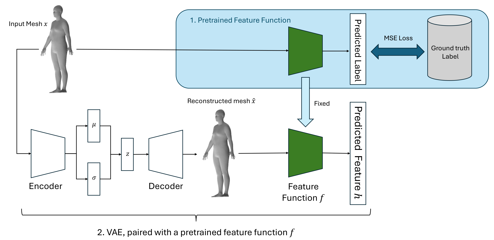

## Pipeline


The basic structure of the network is shown as above. The basic pipeline is like following:

1. **Data Pre-processing**: 
   * Normalize the mesh data. 
   * Prepare the labels. For some of mesh data, it doesn't contain the features we want. So, we need to delete them.
2. **Pretrain the Feature Function**: In this case, we use a neural network as our feature function. 
3. **VAE Training**

## label_process
Our CAESAR data comes from National Research Council. Due to the it is not an open source dataset, we are unable to release it here. 

### label_process/label-process.ipynb

This is a Jupyter Notebook used to process our `metric.xls`. It does two things.

* We select from the `metric.xls` to pick the attributes we need. In the `select_columns(data_frame, type='standardization')` function, there are two types. `standardization` means we do standardization to the features we are hoping to disentangle. `original` means we keep the original data. What's more, excpet that, we need to remove entries with NA value and correponding meshes.
* We make a scatter plot between these features. 


## predictor.ipynb

This is a Jupyter Notebook used to train the predictor network for features, like height, chest circumference, arm length... In the process, we designed two networks as a comparison. One is MLP structure, the other is GNN structure.

* In this version, there is no MLP structure. As in previous version, MLP loss is much larger than the GNN model. Intuitively, it makes sense. As mesh is a structure containing not only point cloud information but also topology information. It is unable for the MLP structure to capture the topology information.
* For the GNN model, we do training for all the features all together by one GNN model. We also try to design three GNN models to train them separately. From the result, there is no much difference.
  * NOTE: for the final loss of the features, we mutiple the corresponding `std` to match their original scale.

## Disentanglement Loss
This is the most important part of our method. The basic idea works as following:

```python
# we need the x to denote as the input graph
x = data.x.to(self.device)

# Feeding a batch of images into the network to obtain the output image, mu, logVar and z
out, mu, logVar, z = self.model(x)
z.retain_grad()

# construct the canonical matrix
# z is of shape (batch_size, latent_dim)

# Now, we need to compute the attributes of the mesh
# 0: height, 1: arm_length, 2: crotch_height, 
# 3: chest_circumference, 4: hip_circumference, 5: waist_circumference,
predicted_result = self.predictor(out)
height = predicted_result[:, 0]

# Compute the gradient of height w.r.t. z
height_grad = torch.autograd.grad(height, z, grad_outputs=torch.ones(height.size()).cuda(), retain_graph=True, create_graph=True)[0]

# compute the the grad loss and divide by the batch size
height_loss = torch.sum(torch.norm(height_grad[:, 1:], dim=1, p=2)) / x.size(0)
```

## AutomaticWeightedLoss

This is a folder containing the code for the automatic weighted loss. The main idea is to use the gradient of the loss to automatically adjust the weight of each term in loss function. The idea comes from the following two papers:

* Multi-Task Learning Using Uncertainty to Weigh Losses for Scene Geometry and Semantics
* Auxiliary Tasks in Multi-task Learning

The implementation is in `models/AutomaticWeightedLoss.py`. The usage is as follows:

```python
loss1=1
loss2=2
awl = AutomaticWeightedLoss(2)
loss_sum = awl([loss1, loss2])

# NOTE: You also need to include the parameters of AWL in the optimizer.
```